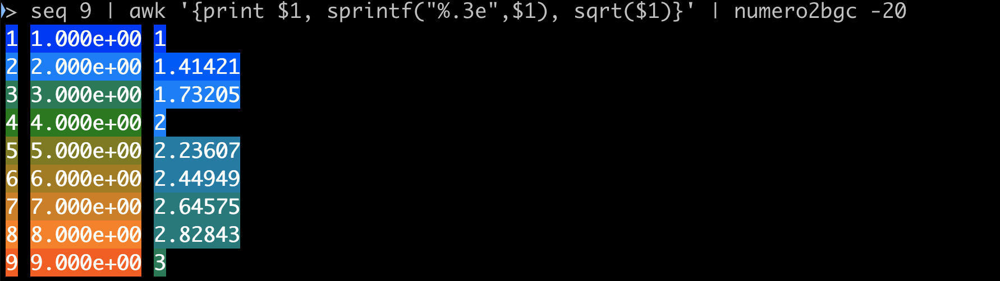
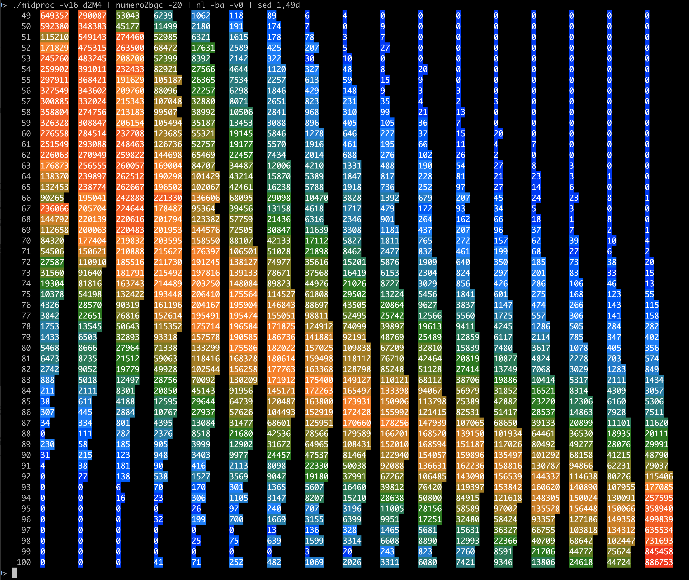

This module provides a Unix-like command `numero2bgc'.

 numero2bgc

   入力のテキストを読み取り、数値の部分を (Regexp::Commons::number を使って)
   抽出して、背景に ANSIエスケープシーケンスによる色を付ける。
   最小値は青、緑を経由して、最大値は赤。15段階。
   (出現数値をuniq化した上で、28分位点をとり、奇数番目の値14個を抽出して、
   それを閾値として、色は段階的に変化させる。)

▼ 提供するソフトウェアについてのライセンス表示

 Copyright (c) 2016-2022 Toshiyuki SHIMONO. All rights reserved.
 This program is free software; you can redistribute it and/or
 modify it under the same terms as Perl itself.
